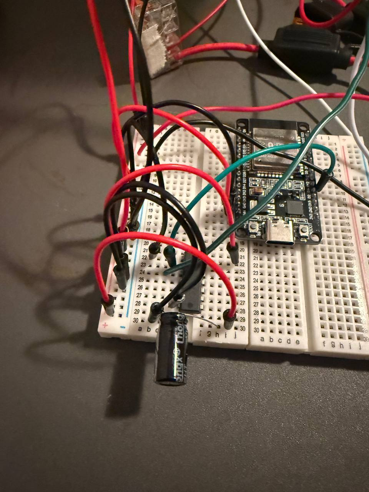
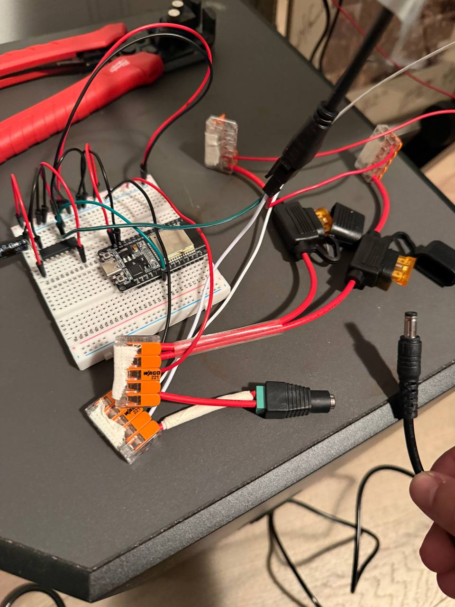

# Via Lucis

**LED piano trainer** — a strip of lights above your piano keys that shows you what to
press, waits until you get it right, and can even play the piano for you.

*Via Lucis* — "the Way of Light."

> ⚠️ **On hold, and not yet usable.** The hardware is built and the firmware runs on it,
> but a latency problem on the key-press → light path currently makes practice mode
> unusable, and the project is paused while I work on other things. Please read
> [Status](#status--read-this-first) before building one.

Prefer the plain-English version? Read [docs/EXPLAINER.md](docs/EXPLAINER.md).

## What it does

An ESP32 connects to your digital piano over Bluetooth MIDI and drives an addressable
LED strip mounted above the keys. Load a MIDI file, and:

- **Wait mode** — the lights show the next note(s) and the song *waits* until you press
  the right keys. Wrong key = red flash on the key you hit. Chords clear per-key as you
  press each correct note.
- **Follow-along** — lights fire in rhythm at any tempo from 1% to 500%.
- **Hands separate** — practice one hand while the *piano itself plays the other hand*
  (the ESP32 sends MIDI back to the piano — no speakers or synth needed).
- **Demo mode** — the piano performs the piece, lights following, so you hear the target.
- **Loop** — repeat any time range (e.g. 0:45–0:50) until it's clean.
- **Lookahead** — upcoming notes glow dim and swell, then jump to full brightness at
  press-time. Lead time and preview brightness are adjustable.

Everything is controlled from a web UI the ESP32 serves over WiFi — your phone is the
remote. No PC at the piano, no app to install.

## Hardware (~$180, no soldering)

See [docs/BOM.md](docs/BOM.md) for the full parts list with links. Summary:

| Part | ~Price |
|------|--------|
| BTF-LIGHTING FCOB LED strip, 180 LED/m, 5V, 2m | $23 |
| ESP32 dev board (classic ESP-WROOM-32) | $7 |
| 5V 10A power supply + barrel-to-screw adapter | $30 |
| 74AHCT125 level shifter | $4 |
| Breadboard + jumper wires | $10 |
| Aluminum mounting channel | $20 |

Plus a **~$59 power-protection add-on** (BOM v2.1, adopted from WLED's wiring
guidance): inline 5A fuses on both strip power feeds, a bulk capacitor, WAGO
lever nuts, hookup wire, and a wire stripper. Still no soldering.

Reference piano: **Roland FP-30X** (Bluetooth MIDI). Any piano with BLE-MIDI should
work; piano-specific quirks are isolated behind one small interface.

## Try the web UI without any hardware

The phone remote can be previewed on your desk right now — a small mock device
serves the real UI against a fake piano (stdlib Python, no dependencies):

```
python tools/mock_device.py
```

then open <http://localhost:8321>. Transport, modes, tempo, loop and track
controls all respond; wait mode holds a pending chord so you can see the
"play these keys" state. It's a UI preview, not a firmware simulator — the
engine itself is covered by the native test suite (see
[docs/SIMULATOR.md](docs/SIMULATOR.md)).

## Status — read this first

**The MVP does not work well enough to use, and the project is on hold.** The firmware is
code-complete for v1–v3 and heavily tested off-device, the board is wired and flashed, and
the piano pairs and drives the strip — but the lights lag the keys badly enough that wait
mode, which is the entire point of the product, is not practiceable. I'm working on other
projects for now, so this is paused rather than actively developed. Everything below is an
honest account of where that leaves it. Nothing here is a finished product recommendation.

### The main problem: latency

An ESP32 has **one radio** shared between BLE (the piano link) and WiFi (the phone
remote). With both up, the key-press → light path picks up a delay you can feel, and HTTP
requests to the web UI can stall for seconds. Two known contributors have already been
fixed during bring-up — WiFi modem power-save under BLE coexistence
([A184](ASSUMPTIONS.md)) and AsyncTCP landing on the same core as the radio work
([A194](ASSUMPTIONS.md)) — and neither closed the gap. The remaining suspects are BLE
connection-interval tuning and plain radio contention between the two stacks. **This is
unresolved and it is the reason the build is not usable yet.**

The uncomfortable version: the latency path was named as the product in this repo's own
rules from day one, and it is the one thing that was never measured until hardware
existed. The engine can be correct in every test and the instrument still be unplayable.

### What works on real hardware

- Flash, boot, and recovery — including the AP-mode config page when WiFi or the
  filesystem is unhappy
- WiFi join, and the web UI served from the ESP32's own flash (no app, no PC at the piano)
- Song storage on LittleFS — 47 MIDI files uploaded and listed, fills to a clean
  "no space" refusal instead of wedging
- Settings, calibration, and AFK config surviving reboots; the WiFi password is stored
  but never handed back out over the API
- BLE-MIDI pairing with the reference piano (Roland FP-30X), stable under sustained use
- Streaming MIDI parse on-device — song load measured at ~363 ms, calibration probe arm
  at ~1.2 s
- The LED strip lights, and follows the loaded song — just not with usable timing

### What is not usable

- **Wait-mode practice** — works mechanically, unusable in feel because of the latency
  above
- **Web UI responsiveness while the piano is connected** — multi-second stalls under
  BLE+WiFi coexistence

### What has not been exercised on hardware at all

Built and tested against the simulator, but never confirmed on the physical device:

- On-device recording (v3)
- Lightshow / ambient `.vls` playback
- Demo and accompaniment modes (the ESP32 playing the piano back)
- Score-follow

Treat these as unverified, not as working.

### Off-device, the software is in good shape

That is the part worth keeping. **530 native tests** pass against a pure-C++ core with no
Arduino headers in it, plus golden `.vls` and MIDI conformance corpora (`corpus/`) pinning
the show-format and SMF parsers byte-exact across firmware, editor, and tools. Design is
locked in [docs/SPEC.md](docs/SPEC.md). The simulator-first approach is what made the
hardware crash cascade diagnosable in hours rather than weeks — it just could not tell us
anything about radio timing, which is precisely where the project is now stuck.

### The build, as it actually looks

Not a rendering. This is the assembled board:





The schematic version of the same wiring is in
[docs/BREADBOARD-GUIDE.md](docs/BREADBOARD-GUIDE.md); the parts list is
[docs/BOM.md](docs/BOM.md).

### If you want to pick this up

It's MIT — go ahead. The design docs, the bring-up log, and every autonomous decision made
along the way are all in the repo ([docs/SPEC.md](docs/SPEC.md),
[docs/BRINGUP.md](docs/BRINGUP.md), [ASSUMPTIONS.md](ASSUMPTIONS.md),
[PROGRESS.md](PROGRESS.md)), including the failures. The latency work starts at A184/A194
in `ASSUMPTIONS.md`. Issues and findings are welcome even while this is paused.

## License

MIT — see [LICENSE](LICENSE).
